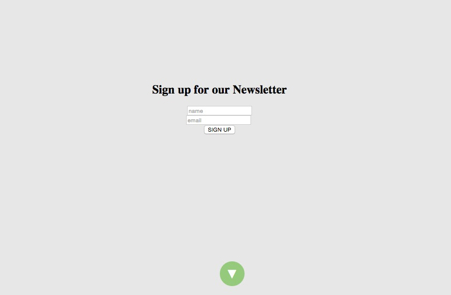
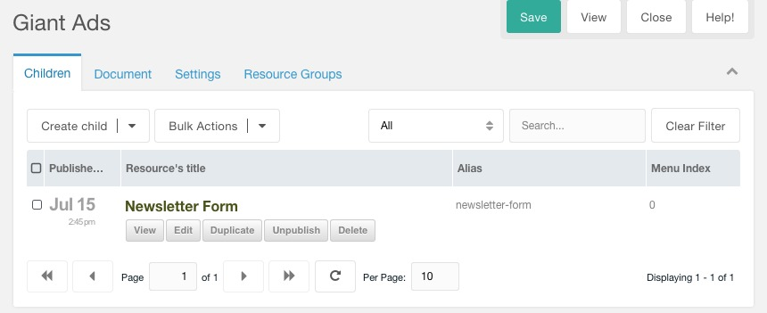
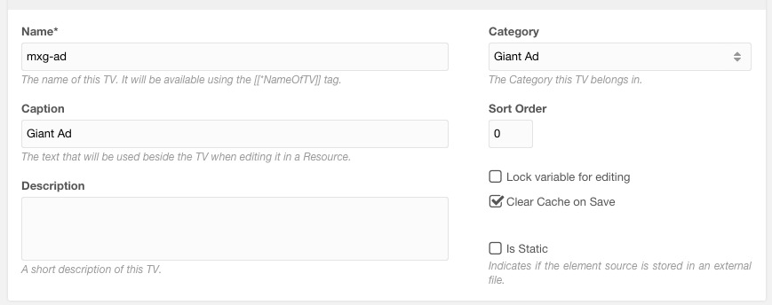
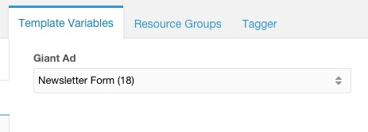

# GiantAdPush
Push a "Giant Ad" to any MODX page

Based on modern ad research and conversion data. It has been quantified that showing fullscreen, non pop-up, advertisements or lead-ins have a greater conversion rate.

This extra will allow you to:

1. Choose from a number of self-created ads
2. Display the ad or message fullscreen above your page content without invasive JS
3. Scroll down or click the down arrow to remove the ad permanently from the DOM.
4. Set the wait buffer you want in the JS



- See it in action - http://flatso.clients.modxcloud.com/surf-city/

##Required Extras

- getResources


##Suggested Extras

- [Collections](http://modx.com/extras/package/collections)


##Roadmap

- Add Fancy jQuery version
- Add Pre-packaged FormIt ready Forms


----

##Create Ads

1. Create either a Collection or a Resource Folder for all your ads. (published but hidden and no template needed)
2. Create a Resource for your ad. Recommend turning off rich text editor if you are pasting in 3rd party scripts.



```
<h2>Sign up for our Newsletter</h2>
<form>
	<input type="text" placeholder="name"><br>
	<input type="text" placeholder="email">
	<br>
	<button>SIGN UP</button>
</form>	
```		

##Setting up the Template Variable

1. Create a new *"Category"* if you want
2. Select a name for the TV *"mxg-ad"*
3. Input Type should be *"Resource List"*
4. "Parents" gets the Parent ID of the ads
5. Include Parents = No
6. Assign your template






##Create Giant Ad Chunk "mxg-ad-content"

1. Use the file *"mxg_wrapper.html"* to create your chunk


##Add TV Call to your Template

1. After `<body>` add:

```
[[[[*mxg-ad:is=``:then=`-`:else=``]]getResources? &resources=`[[*mxg-ad]]` &tpl=`mxg-ad-content` &includeContent=`1` &limit=`1`]]

```

----

##Javscript

If you added the Javascript to your framework and it loads in the footer your done. 

Otherwise add this call to your template footer

```
[[*mxg-ad:notempty=`[[$mxg-ad-js]]`]]
```

and Create a new JS chunk "mxg-ad-js"
